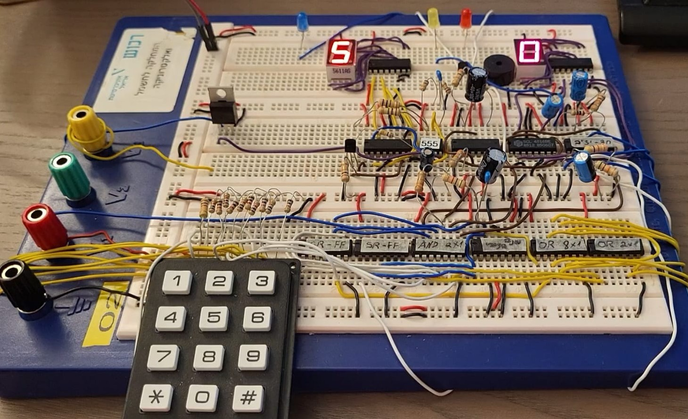
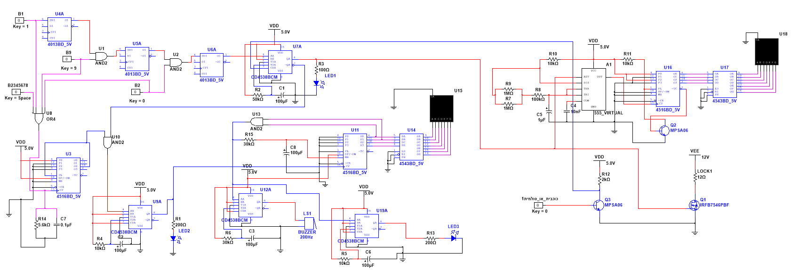
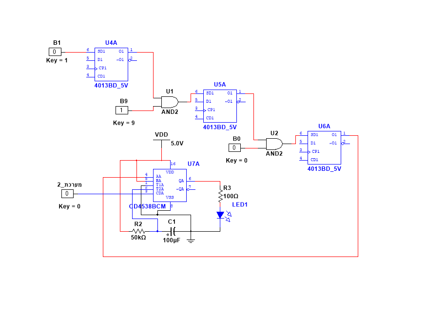
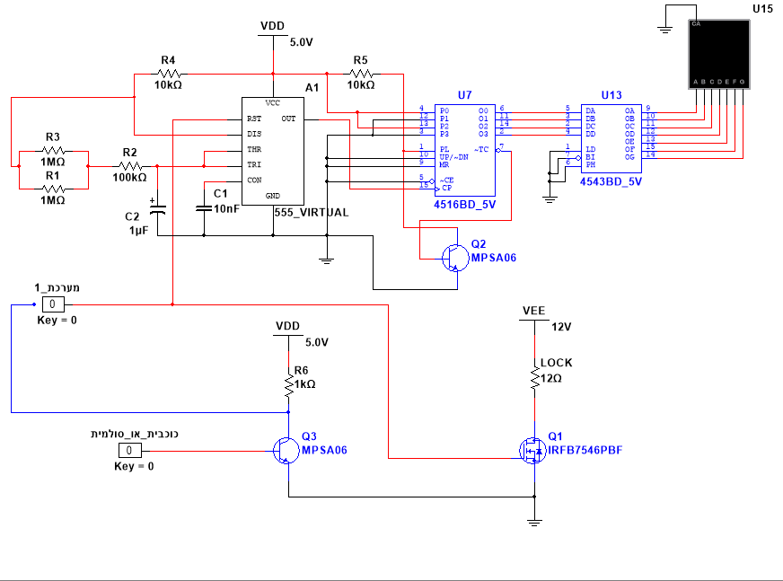
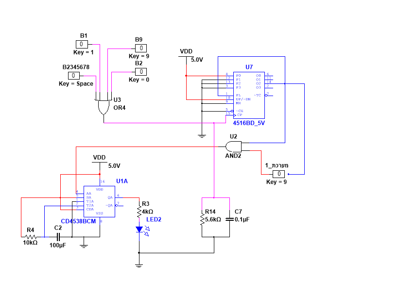
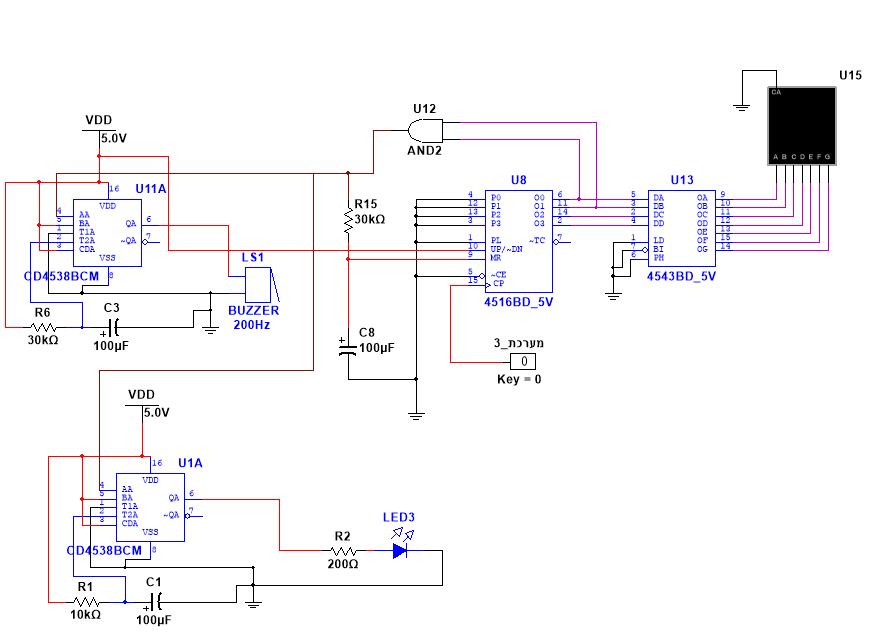

# Electronic Safe: Discrete Digital Logic

An electronic combination lock built **without a microcontroller**, using only discrete CMOS logic: flip-flops, logic gates, binary counters, monostables, a 555 timer, BCD-to-7-segment decoders, and transistor switches. It was designed and simulated in **NI Multisim** and built on a breadboard.

Electronics lab project, Ariel University (2025).



### Full system schematic



---

## Features

- Opens only for the correct **3-digit sequence (1 → 9 → 0)**, entered in order
- **12 V electric lock** driven through a MOSFET, open for **5 seconds**
- **5 → 0 countdown** on a 7-segment display while the safe is open
- Immediate re-lock with the **`*` or `#`** key
- Wrong code: **error LED** for 1 s, and the wrong-attempt counter is shown on a second 7-segment display
- **3 wrong attempts:** buzzer alarm for 3 s plus an alarm LED

## Architecture

The design is split into four subsystems. Each one was designed and simulated separately before they were integrated.

### 1. Correct-code detection



Three flip-flops (CD4013, used through their SET inputs) form a **sequence detector**. Key `1` sets the first stage. Key `9` sets the second stage only if the first is already set (AND gate), and key `0` sets the third stage only if the second is set. When the sequence is complete, a **CD4538 monostable** produces a 5 s pulse (τ = 50 kΩ × 100 µF) that lights LED1 and drives the lock.

### 2. Lock and countdown



- The 5 s pulse drives the gate of an **IRFB7546 MOSFET**, which switches the 12 V lock (low-side).
- The same pulse enables a **555 timer** in astable mode, which clocks a **CD4516** up/down counter once per second.
- The counter is preset to **5 (0101)** and counts down. A **CD4543** decoder drives the 7-segment display.
- At 0, the counter's Carry Out turns on a BJT (MPSA06) that re-asserts Preset Enable, so the counter is ready from 5 again.
- A second BJT, driven by `*` / `#`, resets the sequence detector to lock the safe immediately.

### 3. Wrong-code detection



- An **OR gate** across all digit keys (0–9) clocks a counter on every key press. An RC network on the clock input debounces the keypad.
- After **3 presses**, counter output Q2 goes high. This resets the sequence detector, and the counter is preset again for the next attempt.
- If 3 keys were pressed and the sequence detector did **not** reach its final state, an AND gate triggers a monostable that lights **LED2 for 1 s** (τ = 10 kΩ × 100 µF).

### 4. Three-strike alarm



- Each wrong code clocks a second CD4516 counter. Its value (1, 2, 3) is shown on a 7-segment display through a CD4543 decoder.
- On the third wrong attempt, an AND gate on Q0 and Q1 fires two monostables:
  - a **buzzer for 3 s** (τ = 30 kΩ × 100 µF)
  - **LED3 for 1 s**
- After the alarm, the counter resets to 0.

## Components

| Function | Part |
|---|---|
| Sequence memory | CD4013 flip-flops |
| Timed pulses | CD4538 dual monostable |
| Counting | CD4516 up/down binary counter |
| Display | CD4543 BCD-to-7-segment decoder + 7-segment displays |
| 1 Hz clock | 555 timer (astable) |
| Lock driver | IRFB7546 N-MOSFET, 12 V electric lock |
| Reset/preset switches | MPSA06 NPN BJTs |
| Logic | AND / OR gates |
| Indication | LEDs, 200 Hz buzzer |

## Repository Structure

```
├── schematics/   # NI Multisim source files (full system + 4 subsystems)
├── docs/
│   ├── build_photo.jpg
│   ├── full_system.png
│   ├── 1_correct_code.png
│   ├── 2_lock_countdown.png
│   ├── 3_wrong_code.png
│   ├── 4_three_strikes.png
│   └── poster.pdf    # Project poster (Hebrew)
└── README.md
```

## Tools

NI Multisim · CMOS 4000-series logic · Breadboard prototyping

## Authors

Eitan Marock & Raz Levi
Supervisors: Talia Mandelbrot, Yair Hasid
